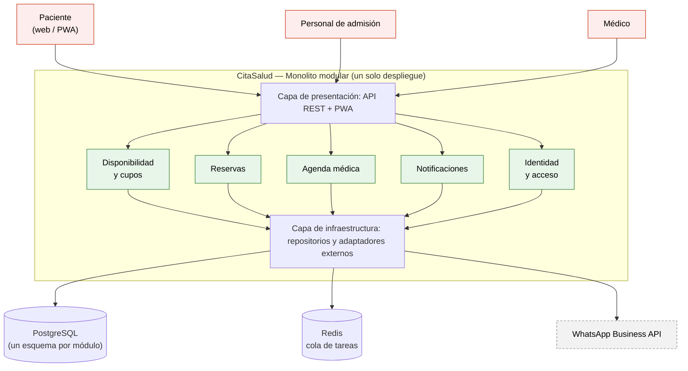
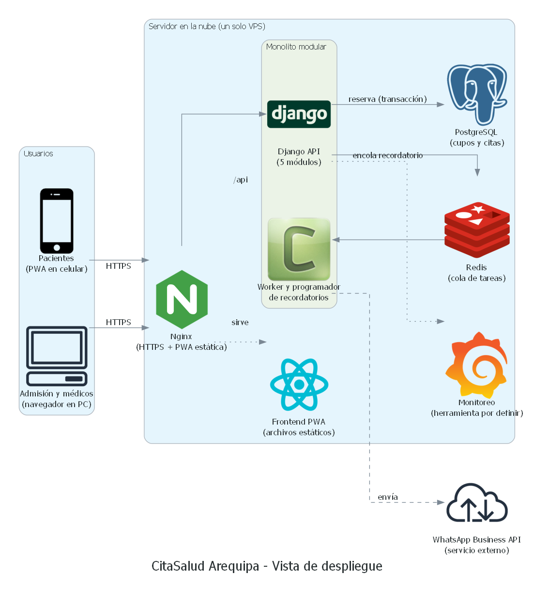
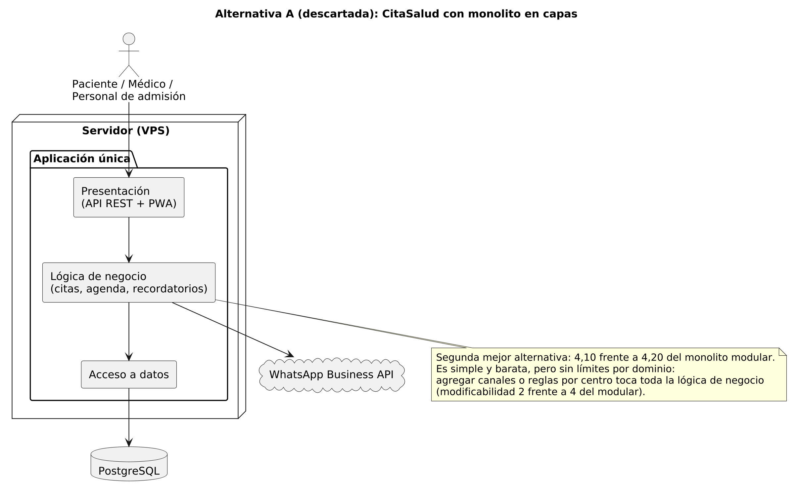

# CitaSalud Arequipa — Laboratorio 04: Fundamentos de arquitectura de software
Construcción de Software · EPIS-UNSA · 2026-B · Grupo 04

## Integrantes
| Nombre | Rol en el laboratorio |
|--------|-----------------------|
| Yana Huanca Christian Alexander | Redactor de ADR y drivers (E1, E4) |
| Estrada Arce Sergio Emilio | Diagramador (E3, E5, E6) |
| Mamani Quispe Renzo Geomar | Verificador de IA, matriz y bitácora (E2, E7) |

## Caso
CitaSalud Arequipa es una plataforma para reservar y cancelar citas en los centros de salud de la región. Los pacientes buscan disponibilidad por especialidad y reservan; el personal de admisión administra los cupos; el médico consulta la lista de pacientes del día; y el sistema envía recordatorios por WhatsApp. El atributo de calidad crítico es la **disponibilidad y el rendimiento**: 5000 pacientes intentan reservar entre las 7:00 y las 7:15 a. m., con p95 ≤ 3 s y ninguna cita asignada dos veces. El MVP debe estar en producción en 1 mes con un equipo de 3 personas y un solo servidor.

## Arquitectura elegida
Monolito modular (un solo despliegue, cinco módulos, PostgreSQL y cola de tareas para los recordatorios).

Vista de despliegue (Python Diagrams) y alternativa descartada (PlantUML):

## Decisiones arquitectónicas
- [ADR-001: Estilo arquitectónico (monolito modular)](docs/architecture/adr/001-estilo-arquitectonico.md)
- [ADR-002: Reserva consistente con PostgreSQL](docs/architecture/adr/002-reserva-consistente-postgresql.md)
- [ADR-003: Recordatorios asíncronos](docs/architecture/adr/003-recordatorios-asincronos.md)
- [ADR-004: Stack tecnológico (Django y React)](docs/architecture/adr/004-stack-tecnologico.md)

## Documentación
| Entregable | Archivo |
|------------|---------|
| E1 Drivers y escenarios | [drivers.md](docs/architecture/drivers.md) |
| E2 Matriz de decisión | [matriz-decision.md](docs/architecture/matriz-decision.md) |
| E3 Diagrama Mermaid | [arquitectura.mmd](docs/architecture/diagramas/arquitectura.mmd) |
| E4 ADR | [adr/](docs/architecture/adr/) |
| E5 Alternativa descartada | [alternativa.puml](docs/architecture/diagramas/alternativa.puml) |
| E6 Vista de despliegue | [despliegue.py](docs/architecture/diagramas/despliegue.py) |
| E7 Bitácora de IA | [bitacora-ia.md](docs/architecture/bitacora-ia.md) |

Para regenerar la vista de despliegue: `pip install diagrams`, instalar Graphviz y ejecutar `python docs/architecture/diagramas/despliegue.py`.

## Reflexión sobre el uso de la IA (5–8 líneas)
[COMPLETAR con palabras del grupo: ¿en qué ayudó la IA? ¿qué errores cometió? ¿qué aprendimos a verificar?]
